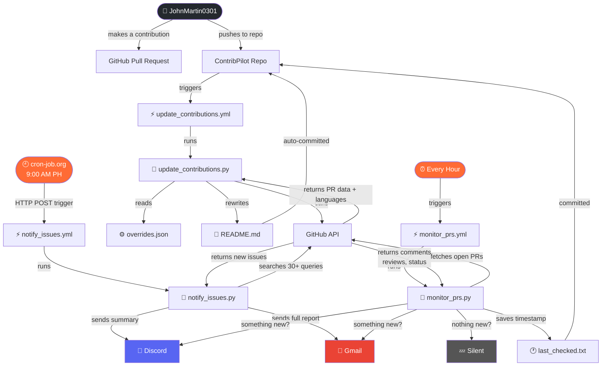

# ✈️ ContribPilot
### Open Source Contribution Automation System

> An automated system that tracks my open-source contributions, hunts for new opportunities every morning, and alerts me the moment something happens on my Pull Requests — all without lifting a finger.

---

## 📌 Quick Stats


---

## 🤔 What Is This?

When you contribute to open-source projects on GitHub, you submit something called a **Pull Request (PR)** — think of it like sending a suggestion to a project. The project owner then reviews it and either accepts, rejects, or asks you to make changes.

**ContribPilot** is a personal automation system I built that does three things automatically:

1. **Tracks** every open-source project I've contributed to and organizes them into a structured list
2. **Hunts** for new issues I can contribute to every morning and delivers them straight to my inbox
3. **Watches** my open Pull Requests 24/7 and alerts me the moment someone responds

Think of it as a personal assistant that manages your entire open-source workflow while you sleep.

---

## ✨ Features

### 🗂️ 1. Contribution Tracker
Automatically keeps a clean, organized record of every open-source project I've contributed to.

- Organizes contributions by **technology** (Frontend, Backend, DevOps)
- Organizes by **type** (Bug Fix, Feature, Documentation)
- Organizes by **domain** (Web Development, Developer Tools)
- Auto-detects the programming languages and frameworks used
- Updates itself automatically — no manual work needed

### 🔍 2. Daily Issue Digest
Every morning at **9:00 AM Philippine time**, it searches GitHub for new issues that match my skills and sends me a full report.

- Searches **30+ queries** across **5 categories** simultaneously
- Finds issues posted in the **last 24 hours** so I never see outdated ones
- Sends a **quick summary to Discord** and a **full detailed report to Gmail**
- Categories it searches:
  - 🔧 Infrastructure Automation / DevOps
  - 🪟 Windows / System-Level Python
  - ⚙️ Backend / API Tools (Flask / FastAPI)
  - 🧰 CLI Tools
  - 🧠 Pro Niche Combos

### 👁️ 3. PR Activity Monitor
Checks all my open Pull Requests every hour and instantly alerts me when something happens.

- Detects new **comments** from repo owners
- Detects new **code reviews** (approved, changes requested)
- Detects **status changes** (merged or closed)
- Only sends a notification when something **actually changed** — no spam
- Sends alerts to both **Discord** and **Gmail**

---

## 🛠️ Tech Stack

| Technology | What It's Used For |
|---|---|
| **Python 3.11** | The brain — runs all the logic and automation |
| **GitHub Actions** | The scheduler — runs everything automatically in the cloud |
| **GitHub API** | The data source — fetches PRs, issues, and repo information |
| **Discord Webhooks** | Instant notifications — quick ping when something happens |
| **Gmail SMTP** | Detailed reports — full digest delivered to your inbox |
| **cron-job.org** | Precise scheduling — triggers the daily digest at exactly 9:00 AM |
| **JSON** | Stores manual corrections via the overrides system |

---

## ⚙️ How It Works

### The Daily Issue Digest (Every morning at 9:00 AM)

```
9:00 AM Philippine Time
        ↓
cron-job.org triggers the workflow
        ↓
GitHub Actions wakes up on a cloud server
        ↓
Python script searches 30+ GitHub queries
        ↓
Filters to only NEW issues from last 24 hours
        ↓
📱 Discord — quick summary ping
📧 Gmail  — full detailed report
```

### The PR Activity Monitor (Every hour)

```
Every hour
        ↓
GitHub Actions wakes up automatically
        ↓
Fetches all open Pull Requests
        ↓
Checks each PR for new comments, reviews, status changes
        ↓
Nothing new? → Silent. No notification.
Something new? → Instant Discord ping + Gmail alert
        ↓
Saves timestamp so next check only looks at NEW activity
```

### The Contribution Tracker (Every push)

```
New contribution made
        ↓
Added to overrides.json with correct details
        ↓
Push to GitHub
        ↓
GitHub Actions triggers automatically
        ↓
Python script fetches all PRs from GitHub API
        ↓
Auto-detects languages, frameworks, and categories
        ↓
Rebuilds README.md with updated contribution tables
        ↓
Commits and pushes the new README automatically
```

---

## 🏗️ System Architecture



---

## 📁 Project Structure

```
ContribPilot/
│
├── 📄 README.md                      ← You are here (auto-generated)
├── 🐍 update_contributions.py        ← Contribution tracker script
├── 🐍 notify_issues.py               ← Daily issue digest script
├── 🐍 monitor_prs.py                 ← PR activity monitor script
├── ⚙️  overrides.json                ← Manual corrections for tech stacks
├── 🕐 last_checked.txt               ← Tracks when PRs were last checked
├── 📜 LICENSE                        ← Proprietary license
│
└── 📁 .github/
    └── 📁 workflows/
        ├── ⚡ update_contributions.yml  ← Runs on every push
        ├── ⚡ notify_issues.yml         ← Triggered by cron-job.org at 9AM
        └── ⚡ monitor_prs.yml           ← Runs every hour
```

---

## 🔐 Security

- All sensitive credentials (Gmail, Discord, GitHub tokens) are stored as **GitHub Secrets** — never written directly in the code
- The GitHub Personal Access Token used for scheduling has **minimal permissions** (workflow scope only)
- Token is set to expire after **1 year** following GitHub's security best practices

---

## 📜 License

Copyright © 2026 John Martin. All rights reserved.

This software and its source code are proprietary and confidential.
Unauthorized copying, distribution, modification, or use of this software,
via any medium, is strictly prohibited without the express written
permission of the copyright owner.

---

## 📬 Connect with Me

- GitHub: [@JohnMartin0301](https://github.com/JohnMartin0301)

---

*Built with 🤖 automation and ☕ coffee*
